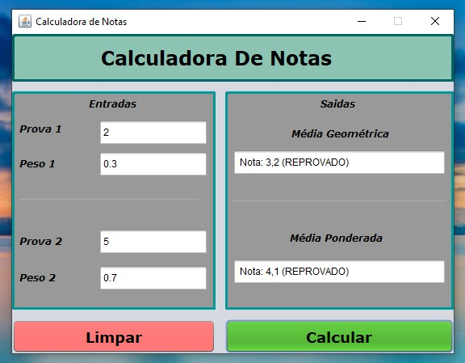

<h1 align="center">
    Calculadora de notas
</h1>

## 💻 Sobre o projeto

Programa desenvolvido em Java para cálculo de medias média aritmética e a média aritmética ponderada.

---

## ⚙️ Funcionalidades

- Realiza o calculo da média aritmética e a média aritmética ponderada;
- Mostra o estado atual de aprovação do aluno com base nos 2 cálculos;
- Interface intuitiva.

---

## 📷 Imagens do projeto

  
  

---

## 🚀 Como executar o projeto

Executar o aplicativo Calculadora de Notas.

---

## 🛠 Tecnologias utilizadas

Foram utilizadas as seguintes ferramentas: Java.

---

## 👨‍💻 Autor
 
 <b>Lucas William Martins Lima</b>
  
 
---
